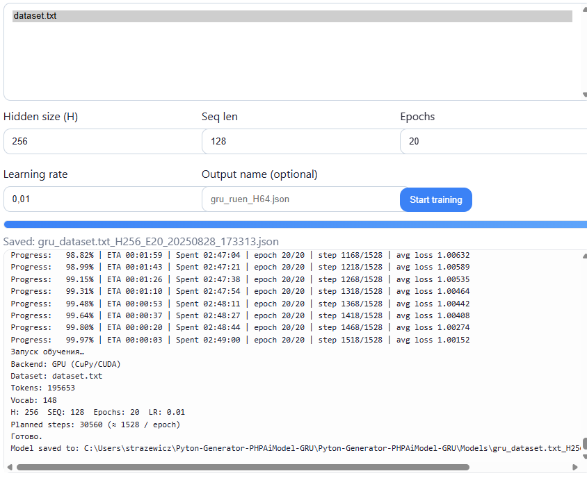

# Pyton-Generator-PHPAiModel-GRU

## Overview

Pyton-Generator-PHPAiModel-GRU is an AI-powered text generation project that leverages a Gated Recurrent Unit (GRU) neural network to generate human-like text. The project integrates Python for model training and inference with a PHP-based interface for user interaction, enabling seamless text generation through a web application. This repository provides tools to train a GRU model on custom datasets and deploy it via a PHP frontend for real-time text generation.

## Features

- **GRU-based Text Generation**: Utilizes a GRU neural network implemented in Python for efficient and high-quality text generation.
- **PHP Web Interface**: A user-friendly PHP frontend to input prompts and display generated text.
- **Customizable Dataset**: Train the model on your own text corpus for domain-specific text generation.
- **Scalable Architecture**: Designed for easy integration and deployment on web servers.




## Prerequisites

To run this project, ensure you have the following installed:

- **Python 3.8+**
  - TensorFlow or PyTorch (for GRU model training)
  - Flask (for API server)
  - NumPy, Pandas (for data preprocessing)
- **PHP 7.4+**
  - Composer (for PHP dependencies)
  - cURL (for API communication)
- **Web Server** (e.g., Apache, Nginx)
- **Git** (for cloning the repository)

## Installation

1. **Clone the Repository**:
   ```bash
   git clone https://github.com/iStark/Pyton-Generator-PHPAiModel-GRU.git
   cd Pyton-Generator-PHPAiModel-GRU
   ```

2. **Set Up Python Environment**:
   ```bash
   python -m venv venv
   source venv/bin/activate  # On Windows: venv\Scripts\activate
   pip install -r requirements.txt
   ```

3. **Set Up PHP Environment**:
   ```bash